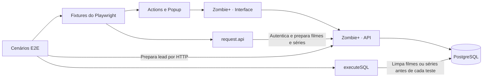

<div align="center">

# 🧟 ZOMBIE+

### Automação de testes · Playwright · JavaScript

**Os zumbis ficam no catálogo. Os bugs entram na mira dos testes.**

Testes end-to-end para a fila de espera, autenticação e gestão de filmes e séries de TV do Zombie+.


Projeto de estudos desenvolvido durante o curso da **QAx**.

**22 cenários em 4 frentes de teste** &nbsp; · &nbsp; **Page Object Model** &nbsp; · &nbsp; **Dados via API e SQL**

[Cenários](#cenarios) · [Novidades](#novidades) · [Arquitetura](#arquitetura) · [Massa de teste](#massa-de-teste) · [Instalação](#instalacao) · [Execução](#execucao) · [Relatórios](#relatorios)

</div>

---

## 🎯 Sobre o projeto

Este repositório reúne os testes automatizados do **Zombie+**, contemplando a fila de espera, a autenticação administrativa e o gerenciamento de filmes e séries de TV. O objetivo é praticar validações de interface, preparação de dados por API e acesso ao banco de dados em testes end-to-end.

A organização utiliza **Page Object Model (POM)** para separar as ações de interface dos cenários, além de fixtures personalizadas do Playwright para disponibilizar páginas e componentes aos testes.

> [!NOTE]
> **Escopo funcional implementado.** Os 22 cenários cobrem os fluxos estudados no curso. Consulte o [estado atual](#estado-atual) para conhecer a última execução registrada e as [melhorias opcionais](#proximos-passos) para evoluir a cobertura.

## 🛠️ Tecnologias

| Tecnologia | Uso no projeto |
| --- | --- |
| JavaScript e Node.js | Linguagem e ambiente de execução |
| Playwright Test | Automação de navegador, asserções e requisições HTTP |
| Chromium | Navegador habilitado na configuração atual |
| Faker | Geração de nomes e e-mails para os testes de leads |
| PostgreSQL e `pg` | Execução de SQL para preparação dos dados |
| `dotenv` | Carregamento das URLs e da conexão PostgreSQL pelo `.env` |
| Docker Compose | Inicialização do banco e do pgAdmin no ambiente local da aplicação |
| Reporter `dot` | Progresso resumido no terminal |
| `playwright-tesults-reporter` | Integração com o Tesults, dependente de um target válido |
| Relatórios locais e evidências | JSON de execução salvo, screenshots e vídeos; HTML disponível por opção de execução |

<a id="cenarios"></a>

## 🧪 Cenários implementados

| Funcionalidade | Quantidade | Cenários presentes |
| --- | --- | --- |
| [Fila de espera](tests/e2e/leads.spec.js) | 6 | Cadastro válido, e-mail duplicado, e-mail inválido, nome vazio, e-mail vazio e ambos os campos vazios |
| [Login administrativo](tests/e2e/login.spec.js) | 6 | Login válido, senha incorreta, e-mail inválido, e-mail vazio, senha vazia e ambos os campos vazios |
| [Filmes](tests/e2e/movies.spec.js) | 5 | Cadastro, remoção, título duplicado, campos obrigatórios e busca pelo termo “zumbi” |
| [Séries de TV](tests/e2e/tvshows.spec.js) | 5 | Cadastro, remoção, título duplicado, campos obrigatórios e busca pelo termo “zumbi” |

No cenário de e-mail duplicado, uma requisição à API cria o lead antes da tentativa pela interface. Nos testes de filmes e séries, a API prepara os registros necessários para os cenários de remoção, duplicidade e busca.

As séries incluem o campo **Temporadas**. O teste de campos vazios verifica os cinco alertas, incluindo `Campo obrigatório (apenas números)`. Após cadastrar ou remover uma série, os testes fecham o popup e verificam sua presença ou ausência na listagem.

A busca de séries começa com três registros: dois com “zumbi” no título e um sem o termo. O teste confere a lista inicial e depois exige exatamente os dois resultados esperados, verificando também a exclusão do registro que não corresponde à busca.

A busca de filmes começa com quatro registros e espera exatamente três resultados. “Guerra Mundial Z” não contém “zumbi” no título e deve ser excluído. As validações conferem os títulos exatos e a quantidade, sem depender da ordem da listagem.

<a id="novidades"></a>

## ✨ Evolução do projeto

Atualizações de **30/09/2026**:

- **Ambiente:** `dotenv` carrega `BASE_URL`, `BASE_API` e as cinco variáveis de conexão PostgreSQL.
- **Navegação:** login e página inicial usam caminhos relativos à `baseURL` do Playwright.
- **API:** `postMovie()` e `postTvShow()` usam `BASE_API`, os mesmos cabeçalhos e validação de resposta bem-sucedida; séries mantêm o campo `seasons`.
- **Relatórios:** `dot` sempre ativo e Tesults opcional por `TESULTS_TARGET`. HTML e JSON podem ser selecionados na execução.
- **Evidências:** screenshots e vídeos ativados, além do trace na primeira nova tentativa.
- **Viewport:** resolução `1440×900` definida no projeto Chromium depois do perfil Desktop Chrome.
- **Leads:** limpeza da tabela em `beforeAll`, antes dos cenários desse arquivo.
- **Preparação de leads:** o cadastro pela API usa `BASE_API`, assim como os helpers de filmes e séries.
- **Configuração local:** `.env` fora do versionamento e `.env.example` disponível para preparar novos ambientes.
- **Busca de filmes:** massa com resultado que deve ser excluído, validação de quantidade e títulos exatos.
- **Resultado registrado:** `test-results.json` contém uma execução com 22 aprovações, sem falhas, testes ignorados ou resultados instáveis.

Implementações anteriores mantidas:

- **Filmes:** ampliação de um cenário de cadastro para cinco cenários de gerenciamento e busca.
- **Séries de TV:** nova suíte com cinco cenários, actions próprias, massa JSON e preparação via `postTvShow()`.
- **Autenticação da API:** chamada explícita a `request.api.setToken()` antes de preparar filmes e séries.
- **Diagnóstico de falhas:** status HTTP e corpo da resposta nas asserções de consulta de empresas e cadastro; mensagem específica quando a empresa não é encontrada.
- **Massa consistente:** campo `release_year` padronizado e nome `Sony Pictures` alinhado ao cadastro usado pela API no cenário de duplicidade.
- **Preparação assíncrona:** uso de `for...of` com `await` para aguardar todos os cadastros antes de navegar e buscar.
- **Limpeza por cenário:** `beforeEach` nas suítes de filmes e séries para evitar conflitos de títulos entre testes.
- **Conexões SQL:** `executeSQL()` retorna as linhas consultadas, encerra o pool em `finally` e propaga erros para o teste.
- **Componentes compartilhados:** `page.popup.haveText()` valida mensagens e `page.popup.close()` fecha o popup antes de verificar a listagem.

<a id="arquitetura"></a>

## 🧩 Como a automação se conecta



| Camada | Responsabilidade | Onde encontrar |
| --- | --- | --- |
| Cenários | Descrever ações e resultados esperados de cada fluxo | [`tests/e2e`](tests/e2e) |
| Actions / Page Objects | Centralizar seletores, interações e validações de página | [`tests/actions`](tests/actions) |
| Popup | Validar mensagens e fechar o diálogo | [`Components.js`](tests/actions/Components.js) |
| Fixtures do Playwright | Disponibilizar `page.leads`, `page.login`, `page.movies`, `page.tvshows`, `page.popup` e `request.api` | [`tests/support/index.js`](tests/support/index.js) |
| Cliente da API | Obter token, consultar empresas e cadastrar filmes e séries para os testes | [`tests/support/api/index.js`](tests/support/api/index.js) |
| Dados de teste | Definir os registros, o termo de busca e os resultados esperados | [`movies.json`](tests/support/fixtures/movies.json) e [`tvshows.json`](tests/support/fixtures/tvshows.json) |
| Banco de dados | Executar SQL e encerrar a conexão após cada chamada | [`database.js`](tests/support/database.js) |

Essa separação permite ajustar uma interação de tela no Page Object e reutilizá-la nos cenários que dependem dela.

## 📁 Estrutura do projeto

```text
zombieplus/
├── tests/
│   ├── e2e/
│   │   ├── leads.spec.js          # Fila de espera
│   │   ├── login.spec.js          # Autenticação administrativa
│   │   ├── movies.spec.js         # Cadastro, remoção, validações e busca de filmes
│   │   └── tvshows.spec.js        # Cadastro, remoção, validações e busca de séries
│   ├── actions/
│   │   ├── Components.js         # Validação e fechamento do popup
│   │   ├── Leads.js              # Página inicial e formulário de leads
│   │   ├── Login.js              # Login e validação do usuário autenticado
│   │   ├── Movies.js             # Área administrativa de filmes
│   │   └── TvShows.js            # Área administrativa de séries
│   └── support/
│       ├── api/
│       │   └── index.js          # Autenticação, empresas, filmes e séries
│       ├── fixtures/
│       │   ├── covers/movies/    # Imagens usadas nos formulários
│       │   ├── movies.json       # Massa de filmes
│       │   └── tvshows.json      # Massa de séries
│       ├── database.js           # Conexão PostgreSQL e execução de SQL
│       └── index.js              # Fixtures personalizadas do Playwright
├── .gitignore
├── .env                        # Configuração local, ignorada pelo Git
├── .env.example                # Modelo de configuração sem segredos
├── package-lock.json
├── package.json
├── playwright.config.js
├── test-results.json           # Relatório salvo de uma execução anterior
└── README.md
```

<a id="massa-de-teste"></a>

## 🗂️ Massa de teste e preparação

Os arquivos JSON seguem a mesma organização:

| Entrada | Uso |
| --- | --- |
| `create` | Cadastro pela interface |
| `to_remove` | Registro criado pela API para remover pela interface |
| `duplicate` | Registro criado pela API antes de tentar cadastrar o mesmo título |
| `search.input` | Termo usado na busca |
| `search.data` | Registros cadastrados pela API antes da busca |
| `search.outputs` | Títulos esperados após filtrar |

Filmes e séries usam `title`, `overview`, `company`, `release_year` e `featured`. Séries também exigem `seasons`. Nos cadastros pela interface, `cover` indica o arquivo a partir de `tests/support/fixtures`; os helpers de cadastro pela API preparam os registros sem enviar capa.

A massa de séries contém títulos fictícios e reutiliza `covers/movies/wwz.png` para testar o upload. Não é necessário baixar capas adicionais para os cenários atuais. As empresas indicadas nos JSONs precisam existir no banco; a massa de séries utiliza `Netflix`.

Exemplo de preparação usado nos testes:

```js
const tvshows = data.search

await request.api.setToken()

for (const tvshow of tvshows.data) {
    await request.api.postTvShow(tvshow)
}
```

`setToken()` autentica em `/sessions` e armazena o Bearer token na instância de `Api` daquele teste. O login pela interface é uma etapa separada. `getCompanyByName()` resolve o nome da empresa para seu ID antes de enviar os dados em `multipart`; o Playwright monta o cabeçalho desse envio.

Antes de cada cenário, `movies.spec.js` executa `DELETE FROM movies` e `tvshows.spec.js` executa `DELETE FROM tvshows`. Essa limpeza remove **todos os registros da respectiva tabela** e deve ser usada em um banco dedicado aos testes. Cada teste prepara os dados de que precisa.

`leads.spec.js` também limpa toda a tabela `leads`, usando `beforeAll` antes dos testes do arquivo. Os nomes e e-mails dos cadastros são gerados com Faker.

A configuração mantém os testes de cada arquivo em sequência (`fullyParallel: false`). Evite executar a mesma suíte simultaneamente contra o mesmo banco: a limpeza de um teste pode remover a massa de outro. Adicionar projetos de navegador ou paralelismo dentro do arquivo exige rever essa estratégia de isolamento.

<a id="instalacao"></a>

## 📦 Instalação

Pré-requisitos:

- Node.js e npm compatíveis com as dependências do projeto. O ambiente consultado utiliza Node.js 24.
- Git para clonar o repositório.
- Aplicação Zombie+ disponibilizada pelo curso: frontend, API e banco preparado.
- Docker Desktop iniciado, caso utilize o PostgreSQL via Docker.

Após clonar este repositório, entre na pasta e instale as dependências e o navegador:

```bash
cd zombieplus
npm ci
npx playwright install chromium
```

> [!IMPORTANT]
> Este repositório contém a automação. O frontend, a API e o `docker-compose.yml` da aplicação são mantidos separadamente e precisam estar disponíveis para executar os testes.

## 🚀 Iniciando a aplicação local

Os exemplos abaixo usam **Git Bash no Windows** e a aplicação instalada em `C:\QAx\apps\zombieplus`. Ajuste os caminhos conforme seu ambiente.

### 1. Banco de dados

Com o Docker Desktop em execução:

```bash
cd /c/QAx/apps/zombieplus
docker compose up -d
```

O Compose local inicia PostgreSQL e pgAdmin. O banco `zombieplus`, suas tabelas e os dados iniciais devem estar preparados conforme as instruções da aplicação fornecida no curso. Subir os contêineres, por si só, não garante essa preparação.

### 2. API

Em outro terminal:

```bash
cd /c/QAx/apps/zombieplus/api
npm run dev
```

### 3. Frontend

Em mais um terminal:

```bash
cd /c/QAx/apps/zombieplus/web
npm run dev
```

Mantenha os terminais da API e do frontend abertos durante os testes.

| Serviço | Endereço local |
| --- | --- |
| Aplicação | http://localhost:3000 |
| Login administrativo | http://localhost:3000/admin/login |
| API | http://localhost:3333 |
| PostgreSQL | `localhost:5432` |
| pgAdmin | http://localhost:16543 |

### Variáveis de ambiente

Copie [`.env.example`](.env.example) para `.env` na raiz do projeto e preencha a senha do banco. No PowerShell, para preparar um ambiente novo:

```powershell
Copy-Item .env.example .env
```

Se já existir um `.env` configurado, apenas ajuste os campos necessários. Exemplo para o ambiente local:

```dotenv
BASE_URL=http://localhost:3000
BASE_API=http://localhost:3333
DB_HOST=localhost
DB_NAME=zombieplus
DB_USER=postgres
DB_PASSWORD=preencha_a_senha_do_banco
DB_PORT=5432
TESULTS_TARGET=
```

`BASE_URL` é lida por [`playwright.config.js`](playwright.config.js), `BASE_API` pelo [cliente da API](tests/support/api/index.js) e `DB_*` pelo [helper SQL](tests/support/database.js). Defina `BASE_API` sem a barra final, pois os endpoints são concatenados com `/sessions`, `/companies`, `/movies` e `/tvshows`.

Os testes utilizam o administrador de estudos `admin@zombieplus.com`, com a senha `pwd123`, que deve existir na aplicação. Essas credenciais de login continuam definidas nos testes e no helper de autenticação.

Quando os testes rodam diretamente no Windows, o host do banco é `localhost`. Para acessar o PostgreSQL pelo pgAdmin na mesma rede do Compose, o host é `database`, nome do serviço.

O ambiente utiliza PostgreSQL local e não depende do ElephantSQL. As empresas `Paramount Pictures`, `Sony Pictures`, `Universal Pictures`, `Fox Entertainment` e `Netflix` precisam estar cadastradas para as massas atuais.

`TESULTS_TARGET` é opcional: mantenha vazio para executar sem envio ao Tesults. Para habilitar a integração, informe o target do projeto no `.env` ou no ambiente de execução. O POST de preparação do lead duplicado também utiliza `BASE_API`.

O `.gitignore` exclui `.env` e suas variações, preservando `.env.example` como modelo compartilhável. Retirar um arquivo do versionamento atual não o remove de commits anteriores; se alguma credencial real tiver sido compartilhada, substitua-a.

<a id="execucao"></a>

## ▶️ Executando os testes

Execute os comandos a partir da raiz **deste repositório de testes**, com a aplicação e o banco disponíveis.

**Primeira execução?** Confira os pontos abaixo:

- [ ] `.env` preenchido com as sete variáveis de ambiente.
- [ ] PostgreSQL iniciado e banco `zombieplus` preparado.
- [ ] API disponível em `localhost:3333`.
- [ ] Frontend disponível em `localhost:3000`.
- [ ] Dependências e Chromium instalados no projeto de testes.

```bash
# Executar todos os cenários localmente, com resultado no terminal
npx playwright test --reporter=line

# Executar com o navegador visível
npx playwright test --headed --reporter=line

# Abrir o modo interativo
npx playwright test --ui --reporter=line

# Depurar um cenário de teste
npx playwright test tests/e2e/leads.spec.js --debug --reporter=line
```

Os comandos acima usam um reporter local. Executar `npx playwright test` sem essa opção utiliza `dot` e também o Tesults quando `TESULTS_TARGET` estiver preenchido.

Para executar por funcionalidade:

```bash
npx playwright test tests/e2e/leads.spec.js --reporter=line
npx playwright test tests/e2e/login.spec.js --reporter=line
npx playwright test tests/e2e/movies.spec.js --reporter=line
npx playwright test tests/e2e/tvshows.spec.js --reporter=line
```

Para executar os dois catálogos em sequência:

```bash
npx playwright test tests/e2e/movies.spec.js tests/e2e/tvshows.spec.js --workers=1 --reporter=line
```

Para conferir os cenários descobertos sem executá-los:

```bash
npx playwright test --list --reporter=line
```

Para filtrar pelo nome de um teste:

```bash
npx playwright test -g "deve cadastrar um lead na fila de espera" --reporter=line
```

<a id="relatorios"></a>

## 📊 Relatórios e configuração

O array atual de reporters contém:

| Reporter | Comportamento |
| --- | --- |
| `dot` | Exibe o progresso no terminal |
| `playwright-tesults-reporter` | Ativado somente com `TESULTS_TARGET` preenchido, usado como `tesults-target` |

A integração depende de um target válido do seu projeto Tesults. Com a variável ausente, vazia ou contendo apenas espaços, o reporter não é carregado. O valor é lido do ambiente; sua presença não comprova que o envio foi concluído. Para configurar o serviço, consulte a [documentação oficial do Tesults para Playwright](https://www.tesults.com/docs/playwright).

**HTML:** para gerar um relatório local, selecione explicitamente esse reporter e depois abra o resultado:

```bash
npx playwright test --reporter=html
npx playwright show-report
```

**JSON:** o arquivo `test-results.json` existente registra uma execução anterior. A configuração atual não o atualiza automaticamente. Para gerar um novo arquivo no PowerShell:

```powershell
$env:PLAYWRIGHT_JSON_OUTPUT_NAME = 'test-results.json'
npx.cmd playwright test --reporter=json
Remove-Item Env:PLAYWRIGHT_JSON_OUTPUT_NAME
```

Também é possível configurar `['json', { outputFile: 'test-results.json' }]` no array de reporters. As opções `--reporter=line`, `--reporter=html` e `--reporter=json` substituem os reporters configurados naquela execução, inclusive o Tesults. Consulte a [documentação de reporters do Playwright](https://playwright.dev/docs/test-reporters).

A configuração em [`playwright.config.js`](playwright.config.js) utiliza:

- **Chromium** com o perfil Desktop Chrome.
- **Reporter `dot` e Tesults opcional**, conforme descrito acima.
- **Screenshots e vídeos em todas as execuções**, salvos em `test-results/`.
- **Duas novas tentativas em CI** e nenhuma nova tentativa automática localmente.
- **Trace na primeira nova tentativa**, quando ela ocorrer.
- **Um worker em CI**; localmente, a quantidade segue o padrão do Playwright.
- **`fullyParallel: false`**: testes de um mesmo arquivo em sequência; arquivos diferentes ainda podem usar workers distintos.

O servidor da aplicação deve ser iniciado manualmente: a opção `webServer` está comentada. A navegação usa `baseURL: process.env.BASE_URL`; o cliente da API usa `process.env.BASE_API`.

**Viewport:** o projeto Chromium define `1440×900` depois do perfil do dispositivo, para manter a resolução escolhida:

```js
use: {
    ...devices['Desktop Chrome'],
    viewport: { width: 1440, height: 900 }
}
```

Esse ajuste já está aplicado em `playwright.config.js`. A ordem das opções do perfil e do viewport é explicada na [documentação de emulação do Playwright](https://playwright.dev/docs/emulation).

Os diretórios `playwright-report/`, `test-results/` e `node_modules/` são ignorados pelo Git. O arquivo `test-results.json`, na raiz, está versionado e não é coberto pela regra que ignora o diretório `test-results/`.

<a id="estado-atual"></a>

## ✅ Estado atual

O projeto contém **22 testes em 4 arquivos**, confirmados com `npx playwright test --list --reporter=line` em **30/09/2026**.

Após os ajustes de fechamento, em **30/09/2026**, a suíte completa foi executada novamente no Chromium com viewport `1440×900`, um worker e reporter local:

```bash
npx playwright test --workers=1 --reporter=line
```

| Resultado | Quantidade |
| --- | --- |
| Aprovados | 22 |
| Falhas | 0 |
| Ignorados | 0 |
| Instáveis (`flaky`) | 0 |

Duração dessa validação: **48,5 segundos**, com **22 testes aprovados**. Não houve envio ao Tesults.

O arquivo `test-results.json` continua guardando a execução anterior de 30/09/2026 às 08:54:32 (Brasília), que também tinha 22 aprovações, em cerca de 14,4 segundos. A nova execução usou `--reporter=line` e, portanto, não atualizou esse JSON.

As pendências anteriores de nomenclatura foram resolvidas: o login utiliza `isLoggedIn()` e o cadastro de filmes recebe `create(movie)`. A estrutura atual de Page Objects está em `tests/actions`.

A cobertura atual utiliza apenas Chromium. Firefox, WebKit e perfis móveis continuam comentados na configuração. A aplicação, os dados iniciais de empresas e o administrador precisam estar disponíveis no ambiente local.

<a id="proximos-passos"></a>

## 🔧 Fechamento e melhorias opcionais

Os cinco ajustes de fechamento foram aplicados:

- `.env` local preservado e retirado do índice do Git, com regras de exclusão e `.env.example`.
- Tesults opcional, configurado por variável de ambiente.
- Viewport `1440×900` aplicado no projeto Chromium.
- Preparação de leads usando `BASE_API`.
- Busca de filmes com resultado que deve ser excluído e validações exatas.

Como melhorias opcionais, vale verificar a presença/ausência na tabela após cadastrar ou remover filmes (como já ocorre em séries), adicionar scripts ao `package.json` e cobrir buscas sem resultados. Para relatórios gerados, considere ignorar `test-results.json` e manter no README apenas um resumo datado da execução.

Uma integração contínua exige disponibilizar a aplicação e o banco no ambiente de execução. Outros navegadores podem ser acrescentados após revisar o isolamento da massa entre projetos.

## 💡 Problemas comuns

<details>
<summary><strong>Comandos, caminhos e terminais no Windows</strong></summary>

| Sintoma | O que verificar |
| --- | --- |
| Git Bash não encontra `C:\QAx\...` | Use o formato `/c/QAx/...` nos comandos `cd`. |
| `no configuration file provided` | Execute o Compose na pasta da aplicação que contém `docker-compose.yml`. |
| PowerShell bloqueia `npm.ps1` | Use `npm.cmd` e `npx.cmd` no lugar de `npm` e `npx`. |

</details>

<details>
<summary><strong>Aplicação, API e conexão com o banco</strong></summary>

| Sintoma | O que verificar |
| --- | --- |
| Navegador não abre a aplicação | Confira se o frontend está iniciado na porta 3000. |
| Requisições à API falham | Confira se a API está iniciada na porta 3333 e consegue acessar o banco. |
| Conexão PostgreSQL recusada | Verifique o Docker, o contêiner e o mapeamento da porta 5432. |
| Banco ou tabela inexistente | Prepare a estrutura e os dados iniciais seguindo as instruções da aplicação. |
| URL inválida ou configuração de banco ausente | Confira se `.env` está na raiz e contém `BASE_URL`, `BASE_API` e as variáveis `DB_*`. |
| Falha de envio ao Tesults | Configure um target válido; para executar apenas localmente, use `--reporter=line`. |
| Relatório HTML ou JSON desatualizado | Esses reporters não estão habilitados por padrão; gere um novo relatório com os comandos da seção de relatórios. |
| `401 — Token not provided` | Chame `await request.api.setToken()` antes de usar `postMovie()` ou `postTvShow()`. |
| Empresa não encontrada | Confira o campo `company` da massa e os nomes cadastrados em `/companies`. |
| `409 — This content is already registered` | Verifique títulos repetidos na própria massa, a limpeza do `beforeEach` e execuções simultâneas no mesmo banco. |
| Erro ao montar o `multipart` | Confira se os campos estão definidos; o ano usa `release_year` e séries também exigem `seasons`. |
| Teste termina durante o preparo da massa | Aguarde as requisições com `for...of` e `await`; `forEach(async ...)` não aguarda os cadastros. |
| Tabela não encontrada após mensagem de sucesso | Feche o diálogo com `await page.popup.close()` antes de validar a listagem por papel. |

</details>

---

<div align="center">

**Do primeiro clique à preparação do banco.**

Um projeto para praticar automação e tornar o comportamento da aplicação verificável.

🧟 &nbsp; JavaScript · Playwright · PostgreSQL

</div>
